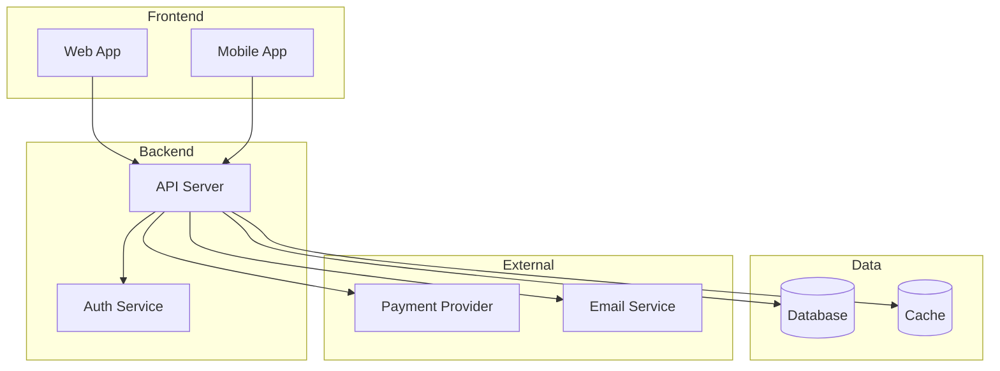
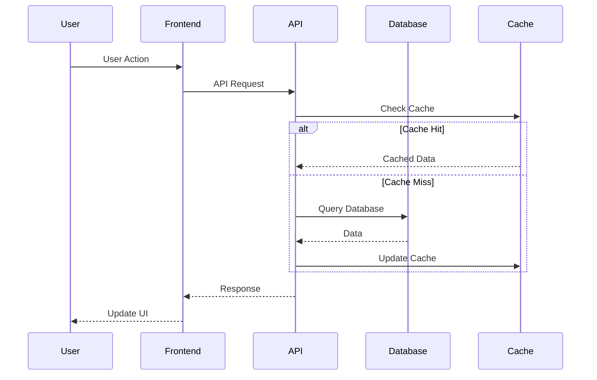

# Architecture

System architecture overview. Auto-generated by `/dm-init` or filled manually.

## Overview

Brief project description: what it does, who it serves.

## System Architecture

## Frontend Architecture

### Tech Stack
Check `config/stack.yaml` for active stack. Example:
- Framework: Next.js / Nuxt / SvelteKit
- State Management: Zustand / Pinia / Svelte stores
- Styling: Tailwind CSS
- Testing: Vitest, Playwright

### Key Patterns
- **Component Composition**: Small, reusable UI components
- **Server Components**: Data fetching on server (Next.js/Nuxt)
- **Client Components**: Interactive UI, state management

## Backend Architecture

### Tech Stack
- Language: TypeScript / Python / Go
- Framework: Next.js API / FastAPI / Gin
- Database: PostgreSQL with ORM
- Cache: Redis

### Key Patterns
- **Repository Pattern**: Abstract data access
- **Service Layer**: Business logic separation
- **Middleware**: Auth, logging, rate limiting

## Data Flow

## External Services

| Service | Purpose | Provider |
|---------|---------|----------|
| Database | Data persistence | Supabase / Neon / Railway |
| Auth | User authentication | Supabase Auth / Auth0 / Clerk |
| Storage | File uploads | S3 / Cloudflare R2 |
| Email | Transactional email | Resend / SendGrid |
| Payments | Payment processing | Stripe |
| Analytics | Usage tracking | PostHog / Mixpanel |

## Security Considerations

- **Authentication**: JWT tokens in httpOnly cookies
- **Authorization**: Row Level Security (RLS) in database
- **Data Encryption**: TLS in transit, encryption at rest
- **Input Validation**: Zod/Pydantic schemas on all inputs
- **Rate Limiting**: Per-user and per-IP limits

## Scalability Plan

| Scale | Architecture |
|-------|--------------|
| 0-10K users | Single server, managed database |
| 10K-100K | Horizontal scaling, read replicas |
| 100K-1M | Microservices, CDN, caching layer |
| 1M+ | Multi-region, event-driven |
