# Project Plan: {PROJECT_NAME}

**Status**: 🟢 Active | 🟡 Planning | 🔴 Blocked | ✅ Complete
**Last Updated**: {TIMESTAMP}
**Project Manager**: PM Agent

---

## Project Overview

**Goal**: {PROJECT_GOAL}

**Scope**:
- {SCOPE_ITEM_1}
- {SCOPE_ITEM_2}
- {SCOPE_ITEM_3}

**Timeline**: {START_DATE} → {TARGET_END_DATE}

---

## Current Status


### Quick Stats
- **Features Completed**: {COMPLETED_COUNT} / {TOTAL_COUNT}
- **Current Phase**: {CURRENT_PHASE}
- **Active Agents**: {ACTIVE_AGENTS}
- **Total Cost**: ${TOTAL_COST}
- **Estimated Remaining**: ${ESTIMATED_REMAINING}

---

## Timeline

```mermaid
gantt
    title Project Timeline
    dateFormat YYYY-MM-DD
    section Planning
    Requirements           :done, plan1, {START_DATE}, 1d
    Architecture Design    :done, plan2, after plan1, 2d
    section Implementation
    Backend Development    :active, impl1, {CURRENT_DATE}, 3d
    Frontend Development   :impl2, after impl1, 3d
    section Verification
    Testing               :test1, after impl2, 2d
    Security Review       :test2, after impl2, 1d
    section Deployment
    Production Release    :deploy, after test1 test2, 1d
```

---

## Active Phases

### Phase 1: Planning & Design ✅
- [x] Requirements gathering
- [x] Architecture design
- [x] Database schema design
- **Status**: Complete
- **Duration**: 3 days
- **Cost**: $2.50

### Phase 2: Implementation 🟡
- [x] Backend API endpoints
- [x] Database integration
- [ ] Frontend components (60% complete)
- [ ] State management
- **Status**: In Progress
- **Duration**: 5 days (3 days remaining)
- **Cost**: $8.20 (estimated $12 total)

### Phase 3: Testing & Review ⏳
- [ ] Unit tests
- [ ] Integration tests
- [ ] Security review
- [ ] Performance optimization
- **Status**: Pending
- **Estimated Duration**: 3 days
- **Estimated Cost**: $5.00

---

## Feature Progress

```mermaid
stateDiagram-v2
    [*] --> Planning
    Planning --> Backend: Design Complete
    Backend --> Frontend: API Ready
    Frontend --> Testing: UI Complete
    Testing --> Review: Tests Pass
    Review --> [*]: Approved

    Backend --> Testing: Direct Path

    note right of Backend
        User Authentication: ✅
        API Endpoints: ✅
        Database: ✅
    end note

    note right of Frontend
        Login Page: ✅
        Dashboard: 🟡 60%
        User Profile: ⏳
    end note
```



---

## Task Breakdown

### Completed ✅
1. ✅ User authentication API (backend-engineer-medium, $0.80)
2. ✅ Database schema setup (database-architect-medium, $1.20)
3. ✅ Login page UI (frontend-engineer-low, $0.50)

### In Progress 🟡
4. 🟡 Dashboard component (frontend-engineer-medium, est. $1.50)
   - Progress: 60%
   - Blocker: None
   - ETA: 1 day

### Pending ⏳
5. ⏳ User profile page (frontend-engineer-low, est. $0.40)
6. ⏳ Unit tests (test-engineer-medium, est. $2.00)
7. ⏳ Security audit (security-reviewer-high, est. $3.00)

---

## Blockers & Risks

### 🔴 Active Blockers
*None currently*

### 🟡 Risks
1. **Risk**: Dashboard complexity increasing
   - **Impact**: Medium
   - **Mitigation**: Consider breaking into smaller components
   - **Owner**: frontend-engineer

2. **Risk**: Security review might find issues
   - **Impact**: High
   - **Mitigation**: Schedule early review, allocate buffer time
   - **Owner**: security-reviewer

---

## Decisions Log

### {DATE} - Use Zustand for State Management
- **Decision**: Chose Zustand over Redux
- **Reason**: Simpler API, less boilerplate, better TypeScript support
- **Impact**: Faster development, easier maintenance
- **Decided By**: architect-medium
- **Status**: Implemented

### {DATE} - PostgreSQL Row Level Security
- **Decision**: Enable RLS for all tables
- **Reason**: Security best practice, defense in depth
- **Impact**: Additional setup time, better security
- **Decided By**: security-reviewer-high
- **Status**: Implemented

---

## Cost Tracking

| Phase | Estimated | Actual | Variance |
|-------|-----------|--------|----------|
| Planning | $3.00 | $2.50 | -$0.50 ✅ |
| Implementation | $12.00 | $8.20 | +$3.80 ✅ |
| Testing | $5.00 | — | — |
| **Total** | **$20.00** | **$10.70** | **+$9.30** |

**Budget Status**: 🟢 Under Budget


---

## Next Steps

1. **Immediate (Today)**:
   - Complete dashboard component (frontend-engineer-medium)
   - Start user profile page (frontend-engineer-low)

2. **This Week**:
   - Finish all frontend components
   - Begin unit test suite
   - Conduct security review

3. **Next Week**:
   - Complete testing phase
   - Fix any security issues
   - Prepare for deployment

---

## Team Communication

**Last Checkpoint**: {LAST_CHECKPOINT_DATE}
**Next Checkpoint**: {NEXT_CHECKPOINT_DATE}

**Key Contacts**:
- Project Manager: PM Agent
- Architecture: Atlas (orchestrator)
- Questions: Use `/help` command

---

## Documentation

- [Work Log](./WORK_LOG.md) - Detailed work history
- [Progress Reports](./features/) - Per-feature progress
- [Decisions](./DECISIONS.md) - Architecture decisions
- [Learnings](./LEARNINGS.md) - Lessons learned

---

*This document is automatically updated by the PM agent as work progresses.*
*Last auto-update: {TIMESTAMP}*
