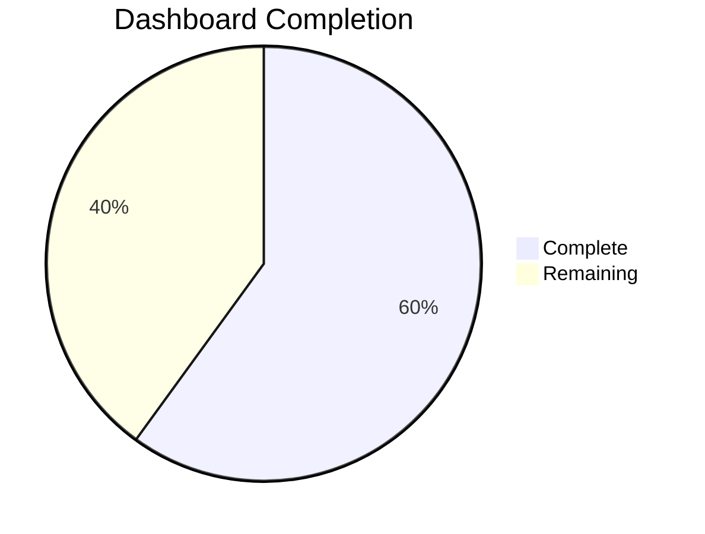
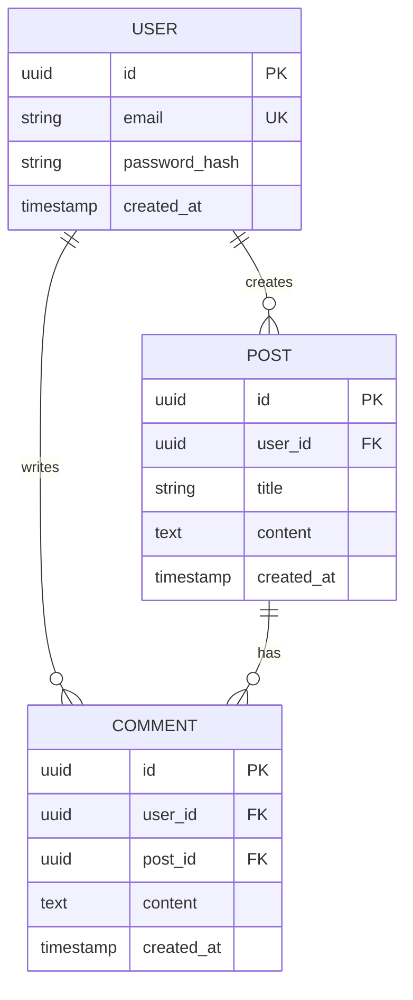
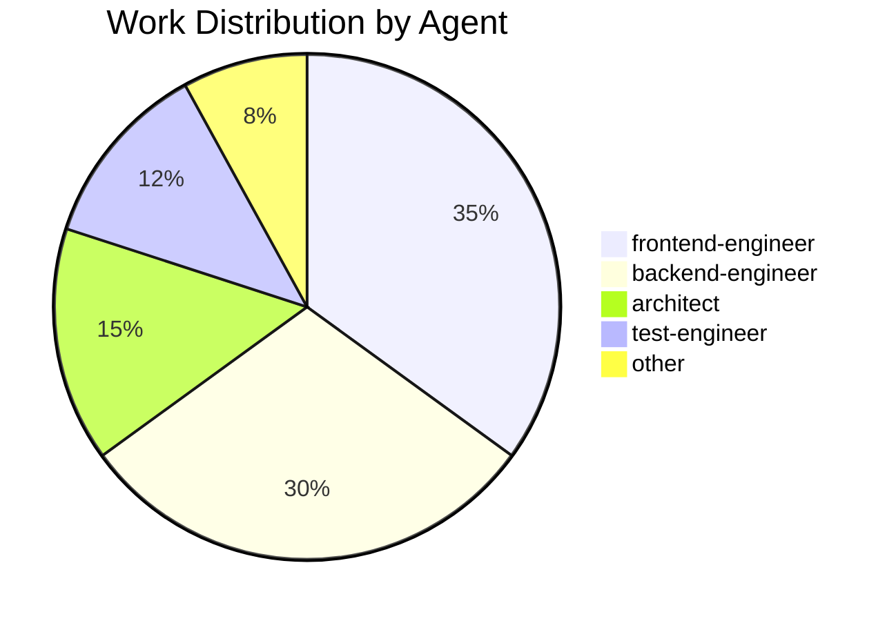

# Work Log

**Project**: {PROJECT_NAME}
**Started**: {PROJECT_START_DATE}

This log tracks all work performed on the project in chronological order.
Each entry includes what was done, by which agent, files modified, and decisions made.

---

## {YYYY-MM-DD}

### {HH:MM} - {Task/Feature Name} ✅

**Status**: ✅ Completed | 🟡 In Progress | 🔴 Blocked
**Agent**: {agent-name} (tier: {low/medium/high})
**Duration**: {duration} minutes
**Cost**: ${cost}
**Tokens**: {input_tokens} in / {output_tokens} out

#### What Was Done
- {bullet point 1}
- {bullet point 2}
- {bullet point 3}

#### Files Modified
- `src/api/auth.ts:42-85` - Added JWT authentication
- `src/routes/login.ts:12-30` - Implemented login endpoint
- `tests/auth.test.ts:1-50` - Added unit tests

#### Evidence
```typescript
// src/api/auth.ts:42
export async function authenticate(token: string) {
  const decoded = jwt.verify(token, process.env.JWT_SECRET);
  return decoded;
}
```

#### Decisions Made
- ✅ Using JWT for stateless authentication
- ✅ Token expiry set to 7 days
- ✅ Refresh token pattern implemented

#### Next Steps
- [ ] Add refresh token rotation
- [ ] Implement rate limiting
- [ ] Add audit logging

#### Notes
Token secret loaded from environment variable for security.
Following OWASP authentication guidelines.

---

### {HH:MM} - {Another Task} 🟡

**Status**: 🟡 In Progress
**Agent**: frontend-engineer-medium
**Duration**: 45 minutes (ongoing)
**Cost**: $1.20 (estimated $2.00 total)

#### What Was Done
- Created dashboard layout component
- Implemented responsive grid system
- Added loading states

#### Files Modified
- `src/components/Dashboard.tsx:1-120` - New component
- `src/styles/dashboard.module.css:1-80` - Styles
- `src/hooks/useDashboardData.ts:1-40` - Data fetching hook

#### Progress


#### Blockers
*None currently*

#### Next Steps
- [ ] Add user stats widgets
- [ ] Implement data visualization
- [ ] Add error boundaries

---

## {PREVIOUS_DATE}

### {HH:MM} - Database Schema Setup ✅

**Status**: ✅ Completed
**Agent**: database-architect-medium
**Duration**: 90 minutes
**Cost**: $1.20
**Tokens**: 5,200 in / 3,800 out

#### What Was Done
- Designed database schema with 5 tables
- Implemented Row Level Security (RLS)
- Created indexes for performance
- Added database migrations

#### Files Modified
- `prisma/schema.prisma:1-150` - Full schema definition
- `prisma/migrations/001_initial.sql:1-200` - Migration SQL
- `src/lib/db.ts:1-40` - Database connection

#### Schema Diagram


#### Decisions Made
- ✅ UUID for primary keys (better distribution, security)
- ✅ Row Level Security enabled (defense in depth)
- ✅ Timestamps with timezone (UTC storage)
- ✅ Cascade delete for referential integrity

#### Security Considerations
- RLS policies ensure users can only access their own data
- Password hashing with bcrypt (cost factor: 12)
- Email uniqueness enforced at database level

#### Performance
- Indexed: user.email, post.user_id, comment.post_id
- Expected query time: < 10ms for user lookup
- Connection pooling: max 20 connections

---

## Template Usage

When PM agent logs work, it uses this format:

```markdown
## {DATE}

### {TIME} - {TASK} {STATUS_EMOJI}

**Status**: {status}
**Agent**: {agent}-{tier}
**Duration**: {duration}
**Cost**: ${cost}

#### What Was Done
- {actions}

#### Files Modified
- {file}:{lines} - {description}

#### Evidence
{code snippet or screenshot}

#### Decisions Made
- {decision}

#### Next Steps
- [ ] {task}

#### Notes
{additional context}
```

---

## Log Statistics

**Total Entries**: {ENTRY_COUNT}
**Total Duration**: {TOTAL_HOURS} hours
**Total Cost**: ${TOTAL_COST}
**Average Cost per Task**: ${AVG_COST}



---

*This log is automatically maintained by the PM agent.*
*Last entry: {LAST_ENTRY_TIMESTAMP}*
